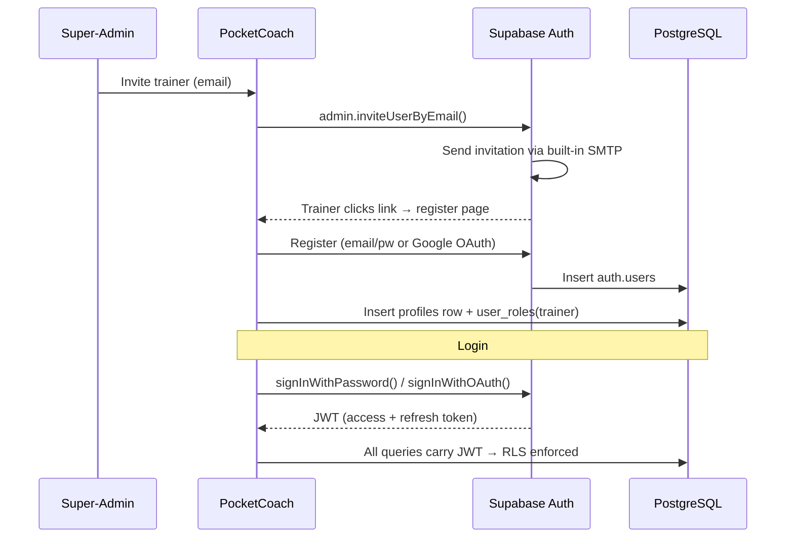

# Authentication & Onboarding

**Summary**: Describes the authentication methods, user invitation flow, and onboarding sequence for PocketCoach, including the Supabase Auth integration and JWT-based RLS enforcement.

**Sources**: None

**Last updated**: 2026-08-18

---

## Table of Contents
- [Authentication Methods](#authentication-methods)
- [Invitation & Registration Flow](#invitation--registration-flow)
- [Calendar Integration](#calendar-integration)

---

## Authentication Methods

| Method | Status |
|---|---|
| Email + Password | ✅ Phase 1 |
| Google Sign-In (OAuth) | ✅ Phase 1 |
| Apple Sign-In (OAuth) | ⏳ Deferred — requires $99/year Apple Developer membership |

Supabase Auth handles all authentication flows natively, issuing JWTs (access + refresh tokens) on successful login. All subsequent database queries carry the JWT, and Row-Level Security (RLS) policies enforce permissions server-side. See [[codebase/architecture/database-schema]] for the full RLS policy matrix.

---

## Invitation & Registration Flow

New trainers are invited by a Super-admin. Invitation emails are sent using Supabase Auth's built-in SMTP — no external email provider is needed in Phase 1.

### Post-Registration

- The base **Trainer** role is automatically granted upon registration.
- The Super-admin can additionally assign **Head-trainer** and/or **Super-admin** roles at any time.
- Trainers can update their display name, profile picture, preferred language, and a free-text "Responsibility / Speciality" field.

---

## Calendar Integration

Trainers can export their assigned sessions to personal calendars. The feature is opt-in and requires explicit user consent.

| Method | Mechanism | Details |
|---|---|---|
| **Static download** | Client-side `ics` library | `.ics` from cached session data. Works offline. |
| **Live subscription** | `GET /functions/v1/calendar-feed?token=<calendar_token>` | Edge Function queries assignments, returns `text/calendar`. Token stored in `profiles.calendar_token`. |

Exported events include: date, time, session location (if available), and co-trainers. Training theme field is omitted until Phase 2.

### Token Security & Revocation

To protect calendar privacy, trainers can regenerate their calendar token at any time in **Profile Settings** via a **"Regenerate Link"** button. Generating a new token immediately invalidates the old URL parameter, disconnecting any previously connected external calendars.

## Related pages

- [[codebase/architecture/system-architecture]]
- [[codebase/architecture/database-schema]]
- [[codebase/data-privacy-gdpr]]
- [[requirements/overview-roles-auth]]
