# Database Schema

**Summary**: PostgreSQL database schema for PocketCoach Phase 1 covering 14 core tables, the ER diagram, column definitions, Row-Level Security policies, and Phase 2 extension points for deferred tables.

**Sources**: None

**Last updated**: 2026-08-18

---

## Table of Contents
- [ER Diagram](#er-diagram)
- [Phase 2 Extension Points](#phase-2-extension-points)
- [Row-Level Security](#row-level-security)

---

## ER Diagram

The schema covers 14 core tables. Phase 2 tables (`training_blocks`, `block_weeks`, `global_themes`, `season_themes`, `training_plan_notes`, `post_session_comments`) are documented as extension points below.

```mermaid
erDiagram
    PROFILES {
        uuid id PK "= auth.users.id"
        text display_name
        text email
        text avatar_url
        text specialty "free-text responsibility field"
        boolean is_junior_coach "14/18 Coach label"
        boolean is_active
        text preferred_language "en | de"
        text calendar_token "opaque token for iCal feed"
        timestamptz created_at
        timestamptz updated_at
    }

    USER_ROLES {
        uuid id PK
        uuid profile_id FK
        text role "trainer | head_trainer | super_admin"
        timestamptz granted_at
        uuid granted_by FK
    }

    DEVICE_TOKENS {
        uuid id PK
        uuid profile_id FK
        text token "FCM push token"
        text platform "web | android | ios"
        timestamptz created_at
        timestamptz updated_at
    }

    SEASONS {
        uuid id PK
        text name
        date start_date
        date end_date
        boolean is_active
        timestamptz created_at
    }

    TRAINING_DAYS {
        uuid id PK
        uuid season_id FK
        smallint day_of_week "0=Sun .. 6=Sat"
        time default_start_time
        time default_end_time
    }

    TRAINING_DAY_PLAYER_GROUPS {
        uuid id PK
        uuid training_day_id FK
        uuid player_group_id FK
    }

    PLAYER_GROUPS {
        uuid id PK
        uuid season_id FK
        text name "Kids/Basic, Advanced-1, Advanced-2"
        text description
        smallint sort_order
    }

    SESSIONS {
        uuid id PK
        uuid season_id FK
        uuid block_week_id FK "nullable — Phase 2 extension"
        date session_date
        smallint day_of_week
        time start_time
        time end_time
        boolean is_time_overridden
        timestamptz created_at
    }

    SESSION_PLAYER_GROUPS {
        uuid id PK
        uuid session_id FK
        uuid player_group_id FK
    }

    SESSION_ASSIGNMENTS {
        uuid id PK
        uuid session_id FK
        uuid profile_id FK "nullable — anonymized on deletion"
        text track "regular | junior_coach"
        text session_role "primary | assistant_coach"
        text status "active | absent_pending_sub | replaced"
        boolean is_substitute
        timestamptz assigned_at
        uuid assigned_by FK
    }

    AVAILABILITY_SURVEYS {
        uuid id PK
        uuid season_id FK
        text name
        date range_start
        date range_end
        text status "draft | open | closed"
        timestamptz created_at
    }

    AVAILABILITY_RESPONSES {
        uuid id PK
        uuid survey_id FK
        uuid profile_id FK
        uuid session_id FK
        text state "available | unavailable | tentative"
        timestamptz responded_at
    }

    SUBSTITUTION_REQUESTS {
        uuid id PK
        uuid session_id FK
        uuid original_trainer_id FK
        uuid volunteer_id FK "nullable"
        text track "regular | junior_coach"
        text status "open | filled | escalated"
        timestamptz created_at
        timestamptz filled_at
        timestamptz escalated_at
    }

    NOTIFICATIONS {
        uuid id PK
        uuid recipient_id FK
        text event_type
        jsonb payload
        boolean is_read
        timestamptz created_at
    }

    PROFILES ||--o{ USER_ROLES : "has roles"
    PROFILES ||--o{ DEVICE_TOKENS : "registers"
    PROFILES ||--o{ SESSION_ASSIGNMENTS : "assigned to"
    PROFILES ||--o{ AVAILABILITY_RESPONSES : "responds"
    PROFILES ||--o{ NOTIFICATIONS : "receives"

    SEASONS ||--o{ TRAINING_DAYS : "has days"
    SEASONS ||--o{ SESSIONS : "generates"
    SEASONS ||--o{ AVAILABILITY_SURVEYS : "runs"
    SEASONS ||--o{ PLAYER_GROUPS : "defines"

    TRAINING_DAYS ||--o{ TRAINING_DAY_PLAYER_GROUPS : "defaults"
    PLAYER_GROUPS ||--o{ TRAINING_DAY_PLAYER_GROUPS : "default for"

    SESSIONS ||--o{ SESSION_ASSIGNMENTS : "has"
    SESSIONS ||--o{ SESSION_PLAYER_GROUPS : "includes"
    SESSIONS ||--o{ SUBSTITUTION_REQUESTS : "may have"

    AVAILABILITY_SURVEYS ||--o{ AVAILABILITY_RESPONSES : "collects"
    PLAYER_GROUPS ||--o{ SESSION_PLAYER_GROUPS : "attends"
```

---

## Phase 2 Extension Points

The following tables will be added in Phase 2 **without modifying existing tables**:

| Future Table | Connects To | How |
|---|---|---|
| `training_blocks` | `seasons` | FK `season_id` → `seasons.id` |
| `block_weeks` | `training_blocks` | FK `block_id` → `training_blocks.id` |
| `global_themes` | (standalone) | Master theme library |
| `season_themes` | `seasons`, `global_themes` | FK to both |
| `block_weeks` | `season_themes` | FK `season_theme_id` |
| `training_plan_notes` | `sessions` | FK `session_id` → `sessions.id`. Head-trainer authored, rich text (Tiptap). |
| `post_session_comments` | `sessions`, `profiles` | FK to both. Append-only comment log per assigned trainer. |

The existing `sessions.block_week_id` column (nullable) is the sole join point for themes. In Phase 1 it is always `NULL`. In Phase 2, sessions are linked to their block week, inheriting the assigned theme. Notes tables connect to `sessions.id` directly. **No Phase 1 migration is altered.**

---

## Row-Level Security

All tables have RLS enabled. `Head-trainer+` = Head-trainer or Super-admin.

| Table | SELECT | INSERT | UPDATE | DELETE |
|---|---|---|---|---|
| `profiles` | All authenticated | Own profile | Own profile | Super-admin |
| `user_roles` | All authenticated | Super-admin | Super-admin | Super-admin |
| `device_tokens` | Own tokens | Own tokens | Own tokens | Own tokens |
| `seasons` | All authenticated | Head-trainer+ | Head-trainer+ | Super-admin |
| `training_days` | All authenticated | Head-trainer+ | Head-trainer+ | Head-trainer+ |
| `training_day_player_groups` | All authenticated | Head-trainer+ | Head-trainer+ | Head-trainer+ |
| `player_groups` | All authenticated | Head-trainer+ | Head-trainer+ | Super-admin |
| `sessions` | All authenticated | System-generated | Head-trainer+ | Super-admin |
| `session_player_groups` | All authenticated | Head-trainer+ | Head-trainer+ | Head-trainer+ |
| `session_assignments` | All authenticated | Head-trainer+ | Head-trainer+ | Head-trainer+ |
| `availability_surveys` | All authenticated | Head-trainer+ | Head-trainer+ | Super-admin |
| `availability_responses` | All authenticated | Own responses (when survey `open`) | Own responses (when survey `open`) | — |
| `substitution_requests` | All authenticated | Own (flag unavail.) | Volunteer (fill gap) / Own (cancel) | — |
| `notifications` | Own only | System (Edge Fn) | Own (mark read) | — |rk read) | — |

## Related pages

- [[codebase/architecture/system-architecture]]
- [[codebase/architecture/auth-and-onboarding]]
- [[codebase/data-privacy-gdpr]]
- [[requirements/overview-roles-auth]]
- [[requirements/sessions-and-assignment]]
