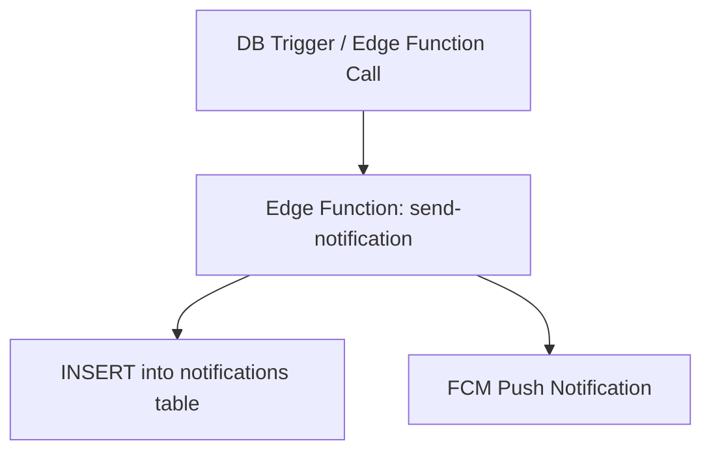

# Notification System

**Summary**: Describes the Phase 1 notification architecture for PocketCoach, covering in-app notifications, FCM push notifications, the event-to-recipient mapping, and the Phase 2 email fallback plan.

**Sources**: None

**Last updated**: 2026-08-18

---

## Table of Contents
- [Architecture](#architecture)
- [Notification Events](#notification-events)
- [Phase 2 Email Fallback](#phase-2-email-fallback)

---

## Architecture

In Phase 1, all notifications are dispatched via two channels: **in-app** (database insert) and **push** (Firebase Cloud Messaging). An Edge Function serves as the central dispatcher.

### Push Notification Registration

- The PWA service worker registers with FCM on first app load.
- Device tokens are stored in a `device_tokens` table linked to `profile_id`.
- Tokens are refreshed on each login; stale tokens are pruned periodically.

---

## Notification Events

All Phase 1 events use **push + in-app** channels.

| Event | Recipients |
|---|---|
| Availability survey sent | All active trainers |
| Assigned to a session | Assigned trainer |
| Trainer flags unavailability | Head-trainers + assigned trainers |
| Substitution request posted | All active trainers |
| Substitution confirmed | Assigned trainers for session |
| No substitute found (48h) | Head-trainers + Super-admins |
| Role changed | Affected user |

---

## Phase 2 Email Fallback

Phase 2 adds **email fallback** (via Resend) for critical events where push delivery is not guaranteed:

- *Availability survey sent*
- *Assigned to a session*
- *No substitute found*

Phase 2 also adds the *Session training plan updated* notification event alongside the session notes feature.

## Related pages

- [[codebase/architecture/system-architecture]]
- [[codebase/architecture/substitution-flow]]
- [[requirements/views-and-notifications]]
