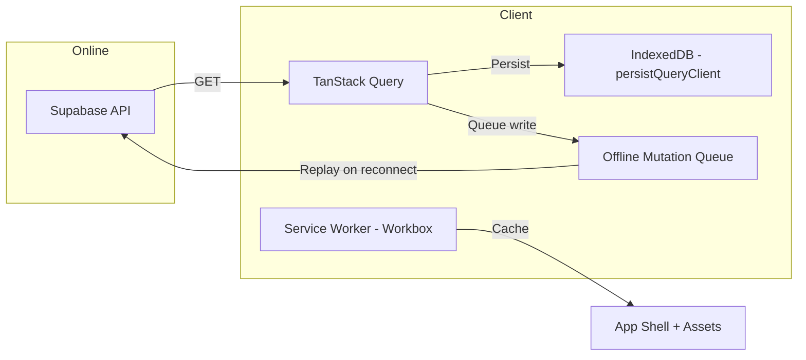

# Offline Support & PWA

**Summary**: Describes the offline architecture for PocketCoach Phase 1, including TanStack Query persistence, IndexedDB caching, the Workbox service worker strategy, and Phase 2 offline mutation plans.

**Sources**: None

**Last updated**: 2026-08-18

---

## Table of Contents
- [Architecture](#architecture)
- [Phase 1 Offline Capabilities](#phase-1-offline-capabilities)
- [Phase 2 Offline Extensions](#phase-2-offline-extensions)

---

## Architecture

### Key Technologies

- **TanStack Query v5** with `persistQueryClient` plugin — persists server-state cache to IndexedDB for offline reads.
- **Workbox** (via `vite-plugin-pwa`) — pre-caches the app shell and static assets for instant offline loading.
- **`navigator.storage.persist()`** — requests persistent storage to prevent browser cache eviction on mobile devices (mitigation for Risk 4 in [[codebase/risk-analysis]]).

---

## Phase 1 Offline Capabilities

| Capability | Implementation |
|---|---|
| View assigned sessions | TanStack Query cache persisted in IndexedDB |
| View availability survey | Cached on first fetch, served from IndexedDB |
| Offline indicator | `navigator.onLine` + events → `<OfflineBanner>` component |
| Persistent storage | `navigator.storage.persist()` to prevent eviction |

The app clearly indicates when it is in offline mode and when a sync is in progress, as required by [[requirements/non-functional-requirements]].

---

## Phase 2 Offline Extensions

Phase 2 extends offline support with **write capabilities**:

- **Draft post-session comments**: Mutations queued in IndexedDB using TanStack Query's offline mutation queue. Replayed automatically on reconnect.
- **View training plan notes**: Cached on first fetch alongside session data.

The append-only comment log model (adopted per [[codebase/risk-analysis]] Risk 1) ensures no offline write-write conflicts when multiple trainers draft comments for the same session.

## Related pages

- [[codebase/architecture/system-architecture]]
- [[codebase/risk-analysis]]
- [[requirements/non-functional-requirements]]
