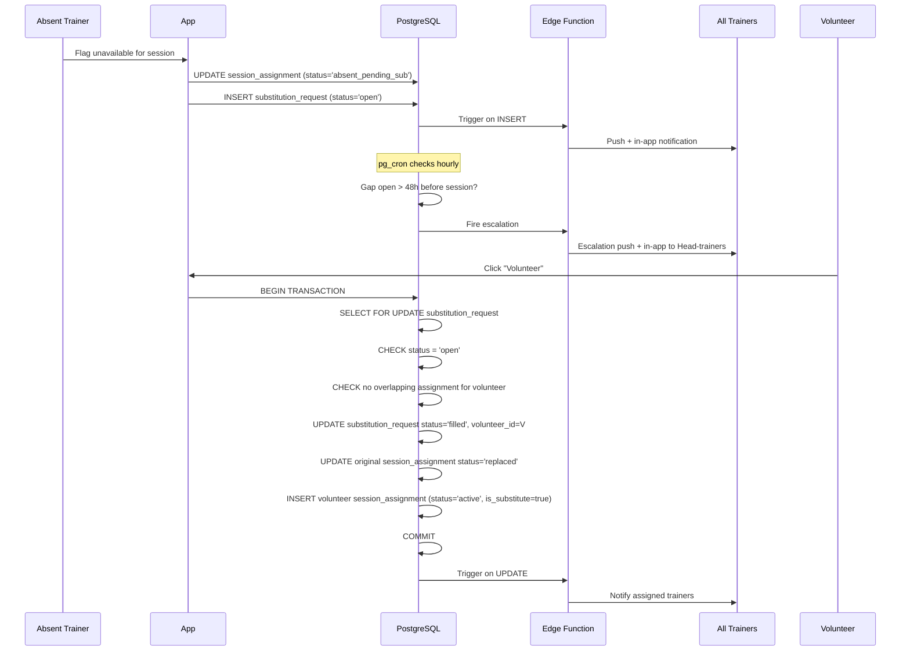

# Substitution Flow

**Summary**: Describes the race-condition-safe substitution workflow for PocketCoach, including the flag-unavailable trigger, volunteer confirmation via database transactions, the 48-hour escalation cron, and double-booking prevention.

**Sources**: None

**Last updated**: 2026-08-18

---

## Table of Contents
- [Overview](#overview)
- [Sequence Diagram](#sequence-diagram)
- [Race-Condition Safety](#race-condition-safety)
- [Escalation Cron](#escalation-cron)

---

## Overview

The substitution system ensures the originally assigned number of trainers per session is maintained. When an assigned trainer cannot attend, the system broadcasts a request and any eligible trainer can volunteer. The volunteer is immediately confirmed — no Head-trainer approval is required.

This replaces the current WhatsApp-based substitution workflow described in [[requirements/sessions-and-assignment]].

---

## Sequence Diagram

---

## Race-Condition Safety

When multiple trainers click "Volunteer" simultaneously, the system prevents double-booking using a PostgreSQL transaction with row-level locking (mitigation for Risk 3 in [[codebase/risk-analysis]]):

1. **`BEGIN TRANSACTION`** — starts an atomic unit of work.
2. **`SELECT FOR UPDATE`** on `substitution_requests` — locks the row, forcing concurrent volunteers to wait.
3. **Status check** — verifies `status = 'open'`. If already `'filled'`, the transaction aborts.
4. **Overlap check** — verifies the volunteer has no existing `session_assignments` during the same time slot.
5. **Write** — updates the request to `'filled'`, sets `volunteer_id`, updates the original trainer's assignment status to `'replaced'`, and inserts the volunteer's new assignment marked `status = 'active'`, `is_substitute = true`.
6. **`COMMIT`** — releases the lock. Any queued concurrent transaction now sees the updated status and aborts cleanly.

---

## Escalation Cron

A `pg_cron` job runs hourly, checking for substitution requests where:
- `status = 'open'`
- The session date is within 48 hours

When triggered, the cron fires a Supabase Edge Function that broadcasts an escalation notification to all Head-trainers and Super-admins for manual follow-up. This is monitored for failures as described in Risk 6 of [[codebase/risk-analysis]].

## Related pages

- [[codebase/architecture/system-architecture]]
- [[codebase/architecture/notification-system]]
- [[codebase/architecture/database-schema]]
- [[codebase/risk-analysis]]
- [[requirements/sessions-and-assignment]]
