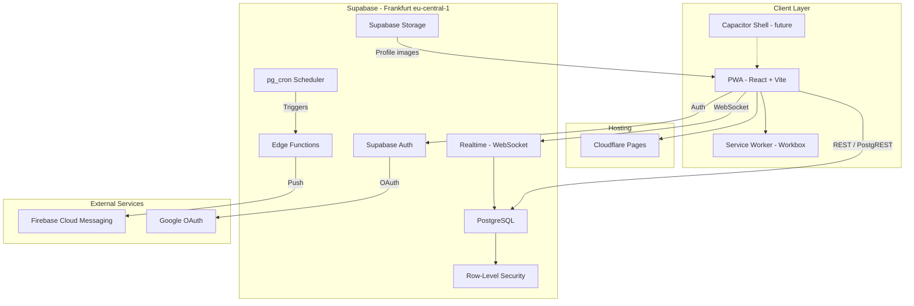

# System Architecture

**Summary**: High-level system architecture for PocketCoach Phase 1, covering scope, resolved technology decisions, the tech stack, architecture diagram, monorepo structure, and feature module breakdown.

**Sources**: None

**Last updated**: 2026-08-18

---

## Table of Contents
- [Scope](#scope)
- [Resolved Decisions](#resolved-decisions)
- [Technology Stack](#technology-stack)
- [High-Level Architecture](#high-level-architecture)
- [Monorepo Structure](#monorepo-structure)
- [Feature Modules & Routes](#feature-modules--routes)

---

## Scope

### Phase 1 — Sessions & Trainer Management

Focus: the operational core of PocketCoach.

| Requirement Doc | In Scope |
|---|---|
| [[requirements/overview-roles-auth]] | ✅ Full — auth, profiles, roles, onboarding |
| [[requirements/sessions-and-assignment]] | ✅ Full — sessions, player groups, assignment tracks, availability surveys, substitutions |
| [[requirements/views-and-notifications]] | ✅ Partial — dashboard, My Sessions, notifications. ⏳ **Session notes deferred to Phase 2** |
| [[requirements/non-functional-requirements]] | ✅ Full — offline, i18n, security, calendar, PWA |
| [[requirements/season-planning]] | ⏳ **Deferred to Phase 2** |

### Phase 2 — Future (Deferred)

Training blocks, weekly themes, global theme library, season theme lists, publishing themes, group-specific notes within the curriculum, **session notes** (training plan notes + post-session comments), and **critical email notifications** (Resend integration for email fallback on key events). The schema and module structure in this plan include **clearly marked extension points** so Phase 2 plugs in without refactoring.

---

## Resolved Decisions

| Decision | Resolution |
|---|---|
| Backend-as-a-Service | **Supabase** (Frankfurt `eu-central-1`) |
| Real-time engine | **Supabase Realtime** (WebSocket) for availability matrix + substitution updates |
| Monorepo | **Turborepo + pnpm workspaces** (`apps/web` + `packages/*`) |
| Sessions without themes | **Accepted** — sessions auto-generated from training days, no theme until Phase 2 |
| Email provider | **Deferred to Phase 2** — invitation emails use Supabase Auth built-in SMTP; critical notification emails (Resend) added in Phase 2 |
| Rich text editor | **Deferred to Phase 2** — Tiptap added with session notes |
| App distribution | **PWA-first** — Capacitor native wrapper as a future option |

---

## Technology Stack

| Layer | Technology | Rationale |
|---|---|---|
| **Frontend** | React 19 + Vite | Fast dev loop, PWA-ready. No SSR needed — no Next.js. |
| **Language** | TypeScript (strict) | End-to-end type safety. |
| **Styling** | Vanilla CSS + CSS Modules | CSS custom properties for design tokens. |
| **Server State** | TanStack Query v5 | Caching, offline persistence (IndexedDB adapter), background sync. |
| **Routing** | React Router v7 | Client-side routing with lazy loading. |
| **Backend / DB** | Supabase (PostgreSQL) | EU-hosted BaaS — Auth, Realtime, Edge Functions, RLS. Frankfurt `eu-central-1`. |
| **Auth** | Supabase Auth | Email/password + Google OAuth. Apple Sign-In deferred. |
| **Push Notifications** | Firebase Cloud Messaging | Free, reliable. Service worker for PWA. |
| **Email (Phase 2)** | Resend | Free tier (3k/mo), EU-compliant. Deferred — Supabase Auth handles invitation emails natively. |
| **Calendar** | `ics` npm + Edge Function feed | `.ics` download + live subscription endpoint. |
| **Rich Text (Phase 2)** | Tiptap | Headless, stores HTML/JSON, works offline. Deferred with session notes. |
| **i18n** | react-i18next | Namespaced translations, lazy-loaded locale files. |
| **PWA** | vite-plugin-pwa (Workbox) | Service worker, offline cache, install prompt. |
| **Native (future)** | Capacitor | Same codebase → native Android/iOS. |
| **Hosting** | Cloudflare Pages | Free, EU edge, Git-based deploys. |
| **Monorepo** | Turborepo + pnpm | Shared packages, fast builds. |
| **Cron** | Supabase `pg_cron` + Edge Functions | 48h substitution escalation. |

---

## High-Level Architecture



---

## Monorepo Structure

```
pocket-coach-codebase/
├── apps/
│   └── web/                              # React + Vite PWA
│       ├── public/
│       │   ├── manifest.json
│       │   ├── icons/
│       │   └── locales/
│       │       ├── en/
│       │       └── de/
│       ├── src/
│       │   ├── main.tsx
│       │   ├── App.tsx                   # Root + router
│       │   ├── components/
│       │   │   ├── ui/                   # Button, Card, Modal, Badge, etc.
│       │   │   ├── layout/              # Shell, Sidebar, Header, BottomNav
│       │   │   └── feedback/            # Toast, Spinner, EmptyState, OfflineBanner
│       │   ├── features/
│       │   │   ├── auth/                # Login, Register, Invite
│       │   │   ├── dashboard/           # Admin / Head-trainer overview
│       │   │   ├── sessions/            # Session list, detail (notes in Phase 2)
│       │   │   ├── availability/        # Survey form, availability matrix
│       │   │   ├── substitutions/       # Gap list, volunteer flow
│       │   │   ├── trainers/            # Roster, profile, role management
│       │   │   ├── calendar/            # iCal export, subscription
│       │   │   ├── notifications/       # Bell, drawer, push registration
│       │   │   ├── settings/            # Profile, language
│       │   │   └── season/              # ⏳ Phase 2: blocks, themes, curriculum
│       │   ├── hooks/
│       │   ├── lib/                     # Supabase client, query keys, helpers
│       │   ├── styles/                  # Global CSS, design tokens
│       │   └── i18n/
│       ├── index.html
│       ├── vite.config.ts
│       └── package.json
│
├── packages/
│   ├── shared-types/
│   │   └── src/
│   │       ├── database.ts             # Generated Supabase types
│   │       ├── roles.ts                # Role enum + permission helpers
│   │       ├── availability.ts         # Survey state types
│   │       └── index.ts
│   │
│   └── supabase/
│       ├── migrations/                 # SQL migration files
│       ├── functions/
│       │   ├── send-notification/      # Push + in-app dispatcher
│       │   ├── escalation-check/       # 48h gap cron
│       │   └── calendar-feed/          # iCal subscription endpoint
│       ├── seed.sql
│       └── config.toml
│
├── turbo.json
├── pnpm-workspace.yaml
├── package.json
└── .env.example
```

The `features/season/` directory is created as an empty placeholder with an `index.ts` re-export stub. Session notes components (TrainingPlanEditor, PostSessionLog) will also be added in Phase 2. Both are purely additive changes.

---

## Feature Modules & Routes

| Feature | Route(s) | Key Components | Phase |
|---|---|---|---|
| **Auth** | `/login`, `/register`, `/invite/:token` | LoginForm, RegisterForm, GoogleOAuthButton | 1 |
| **Dashboard** | `/dashboard` | SeasonOverview, TrainerRoster, AvailabilityMatrix, SubstitutionActivity, CoverageGaps | 1 |
| **Sessions** | `/sessions`, `/sessions/:id` | SessionList, SessionDetail | 1 |
| **Availability** | `/availability`, `/availability/:surveyId` | SurveyForm, AvailabilityGrid, TrainerTypeFilter | 1 |
| **Substitutions** | `/substitutions` | GapList, VolunteerButton | 1 |
| **Trainers** | `/trainers`, `/trainers/:id` | TrainerList, TrainerProfile, RoleManager, SessionStats | 1 |
| **Calendar** | `/settings/calendar` | CalendarExportButton, SubscriptionLink | 1 |
| **Notifications** | (global) | NotificationBell, NotificationDrawer | 1 |
| **Settings** | `/settings` | LanguagePicker, ProfileEditor | 1 |
| **Session Notes** | (within `/sessions/:id`) | TrainingPlanEditor (Tiptap), PostSessionLog | **2** |
| **Season Planning** | `/seasons/:id/blocks`, `/themes` | BlockTimeline, ThemeLibrary, WeekThemeAssigner | **2** |

## Related pages

- [[codebase/implementation-plan]]
- [[codebase/architecture/database-schema]]
- [[codebase/architecture/auth-and-onboarding]]
- [[codebase/architecture/notification-system]]
- [[codebase/architecture/offline-and-pwa]]
- [[codebase/architecture/substitution-flow]]
- [[codebase/feasibility-and-costs]]
- [[codebase/data-privacy-gdpr]]
- [[codebase/risk-analysis]]
- [[requirements/readme]]
