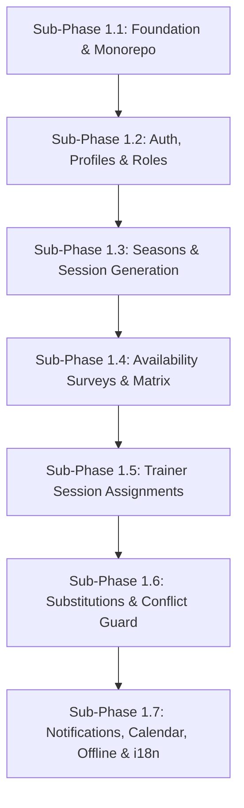

# Implementation Plan (Phase 1)

**Summary**: Sequential, testable 7-step implementation plan for PocketCoach Phase 1 (Sessions & Trainer Management), covering sub-phases 1.1 through 1.7 with explicit component changes, database migrations, and testable milestones for each phase.

**Sources**: None

**Last updated**: 2026-08-18

---

## Table of Contents
- [Overview & Workflow](#overview--workflow)
- [Sub-Phase 1.1: Project Setup & Monorepo Foundation](#sub-phase-11-project-setup--monorepo-foundation)
- [Sub-Phase 1.2: Authentication, User Profiles & Role Management](#sub-phase-12-authentication-user-profiles--role-management)
- [Sub-Phase 1.3: Seasons, Training Days & Automatic Session Generation](#sub-phase-13-seasons-training-days--automatic-session-generation)
- [Sub-Phase 1.4: Availability Surveys & Matrix Dashboard](#sub-phase-14-availability-surveys--matrix-dashboard)
- [Sub-Phase 1.5: Trainer Session Assignments & Personal View](#sub-phase-15-trainer-session-assignments--personal-view)
- [Sub-Phase 1.6: Smart Substitutions & Race-Condition Guard](#sub-phase-16-smart-substitutions--race-condition-guard)
- [Sub-Phase 1.7: Notifications, Calendar Sync, Offline & i18n Polish](#sub-phase-17-notifications-calendar-sync-offline--i18n-polish)
- [Verification & Acceptance Summary](#verification--acceptance-summary)

---

## Overview & Workflow

The Phase 1 implementation is broken down into **7 incremental sub-phases**. Each sub-phase produces a fully compiled, testable version of the application before proceeding to the next.

---

### Sub-Phase 1.1: Project Setup & Monorepo Foundation

**Goal**: Establish the Turborepo monorepo, design tokens, UI layout primitives, and local Supabase development environment with automated test seed data.

#### Proposed Changes

##### Root & Monorepo Config
- `package.json`, `pnpm-workspace.yaml`, `turbo.json`

##### `packages/shared-types`
- TypeScript definitions for database models, roles, and API DTOs

##### `packages/supabase`
- Supabase CLI configuration, local migration scripts
- `seed.sql`: Pre-populated test accounts (`admin@club.de`, `headtrainer@club.de`, `trainer1@club.de`, `junior1@club.de`) for instant testing after each sub-phase

##### `apps/web` (React 19 + Vite)
- Design token CSS variables (`src/styles/tokens.css`, `src/styles/global.css`)
- Layout components: `Shell`, `Header`, `Sidebar`, `BottomNav`
- Router setup (`React Router v7`) with placeholder routes
- UI primitives: `Button`, `Card`, `Modal`, `Badge`, `Spinner`, `Toast`

#### Testable Milestone 1.1
- [x] Run `pnpm dev` → launches app shell with responsive sidebar (desktop) and bottom nav (mobile).
- [x] Run `supabase start` → local Postgres DB starts with pre-populated test accounts in `seed.sql`.
- [x] Run `pnpm build` → clean compilation across all monorepo workspaces.

---

### Sub-Phase 1.2: Authentication, User Profiles & Role Management

**Goal**: Implement email/password login, Google OAuth, Super-admin user invitation flow, profile management, and role-based permissions (Trainer, Head-trainer, Super-admin).

#### Proposed Changes

##### Database Migrations (`packages/supabase/migrations/`)
- `01_profiles.sql`: Create `profiles` table (`id`, `display_name`, `email`, `avatar_url`, `specialty`, `is_junior_coach`, `is_active`, `preferred_language`, `calendar_token`)
- `02_user_roles.sql`: Create `user_roles` table (`id`, `profile_id`, `role`, `granted_at`, `granted_by`)
- Row-Level Security (RLS) policies for profiles and user roles

##### Web Application (`apps/web/src/features/`)
- `features/auth/`: `LoginForm`, `RegisterForm`, `InviteForm`, `GoogleOAuthButton`
- `features/trainers/`: `TrainerRoster`, `TrainerProfile`, `RoleManager`, `SpecialtyEditor`
- `lib/supabase.ts`: Supabase client setup with auth session listener
- `hooks/useAuth.ts`, `hooks/usePermissions.ts`: Permission evaluation hooks

#### Testable Milestone 1.2
- [x] Super-admin logs in and invites a new trainer via email (`/trainers`).
- [x] Inbucket local email dashboard (`http://localhost:54324`) captures the invitation link.
- [x] Invited trainer opens invitation link (`/invite/:token`), completes registration, and gets the base **Trainer** role automatically.
- [x] Trainer edits display name, avatar, and free-text "Responsibility / Speciality" in `/settings`.
- [x] Super-admin grants **Head-trainer** role to a user; elevated permissions unlock immediately without re-login.

---

### Sub-Phase 1.3: Seasons, Training Days & Automatic Session Generation

**Goal**: Configure training seasons and weekly training days, and automatically batch-generate session records for the entire season date range.

#### Proposed Changes

##### Database Migrations (`packages/supabase/migrations/`)
- `03_seasons.sql`: Create `seasons` table (`id`, `name`, `start_date`, `end_date`, `is_active`)
- `04_training_days.sql`: Create `training_days` (`id`, `season_id`, `day_of_week`, `default_start_time`, `default_end_time`) and `training_day_player_groups` join table
- `05_player_groups.sql`: Create `player_groups` table (`id`, `season_id`, `name`, `description`, `sort_order`)
- `06_sessions.sql`: Create `sessions` (`id`, `season_id`, `block_week_id` nullable, `session_date`, `day_of_week`, `start_time`, `end_time`, `is_time_overridden`) and `session_player_groups` join table
- Database trigger / function: `generate_season_sessions(season_id)` to auto-populate `sessions` and default `session_player_groups` for all configured training days.

##### Web Application (`apps/web/src/features/`)
- `features/season/`: `SeasonSetupForm` (season container + weekday time slots + default player group assignment per day)
- `features/sessions/`: `SessionList` (chronological list with date/day filters), `SessionDetail` (view time, player groups, default slots)

#### Testable Milestone 1.3
- [x] Head-trainer creates a Season (e.g. Aug 1 – Jul 31) and configures training days (e.g. Tuesdays 19:00–21:00 with Advanced-1/2, Fridays 18:30–20:30 with Kids/Basic).
- [x] System automatically batch-generates all session records for every Tuesday and Friday in that date range with their default player groups attached.
- [x] Head-trainer browses `/sessions` and sees the complete auto-generated schedule.
- [x] Head-trainer overrides time or player groups for a specific holiday session.

---

### Sub-Phase 1.4: Availability Surveys & Matrix Dashboard

**Goal**: Implement availability survey creation, trainer date-by-date responses, and the Head-trainer scrollable Availability Matrix grid with sticky headers, month quick filters, workload summaries, and survey locking.

#### Proposed Changes

##### Database Migrations (`packages/supabase/migrations/`)
- `07_availability.sql`: Create `availability_surveys` (`id`, `season_id`, `name`, `range_start`, `range_end`, `status`) and `availability_responses` (`id`, `survey_id`, `profile_id`, `session_id`, `state`)
- RLS policy: Restrict response updates to when `AVAILABILITY_SURVEYS.status = 'open'`.

##### Web Application (`apps/web/src/features/`)
- `features/availability/`:
  - `SurveyCreateModal`: Create survey for date range (e.g. Aug–Dec)
  - `TrainerSurveyForm`: Mobile-friendly list where trainers tap ✅ Available, ❌ Unavailable, 🔶 Tentative per session
  - `AvailabilityGrid`: Scrollable matrix with sticky date column (left) and trainer header (top), plus a Month Quick Filter tab bar (e.g. All, Aug, Sep, Oct)
  - `TrainerTypeFilter`: Toggle matrix between Regular Trainers and 14/18 Coaches
  - `WorkloadSummaryRow`: Dual summary metrics (Completed Sessions vs. Total Assigned)
- `features/dashboard/`: `AdminDashboard` shell integrating the matrix and quick stats

#### Testable Milestone 1.4
- [x] Head-trainer creates Survey 1 (Aug–Dec) and sets status to `open`.
- [x] Trainers open `/availability` and respond date-by-date.
- [x] Head-trainer views `/dashboard` matrix with sticky headers, filters by Month tab, and watches grid update live as trainers respond.
- [x] Head-trainer toggles matrix view between Regular Trainers and 14/18 Coaches, inspecting workload totals.
- [x] Head-trainer sets survey to `closed` → trainers can no longer modify responses (RLS & UI locked).

---

### Sub-Phase 1.5: Trainer Session Assignments & Personal View

**Goal**: Enable Head-trainers to assign trainers to sessions via direct cell clicks in the matrix or a bulk assignment tool across 2 independent tracks, and provide trainers with their personal "My Sessions" schedule and statistics breakdown.

#### Proposed Changes

##### Database Migrations (`packages/supabase/migrations/`)
- `08_assignments.sql`: Create `session_assignments` (`id`, `session_id`, `profile_id`, `track`, `session_role`, `status`, `is_substitute`, `assigned_at`, `assigned_by`)

##### Web Application (`apps/web/src/features/`)
- `features/sessions/`:
  - `MatrixAssignPopover`: Click any matrix cell to assign/unassign a trainer with 1 tap.
  - `BulkAssignModal`: Select a trainer and recurring weekday pattern (e.g. "Assign Trainer A to all Fridays in Aug–Dec") to batch-assign in 1 click.
  - `MySessionsList`: Chronological view of user's own upcoming assigned sessions.
  - `PersonalStatsCard`: Breakdown by role (Trainer, Assistant-coach, 14/18 Coach, Total) showing Completed vs. Total Assigned.

#### Testable Milestone 1.5
- [x] Head-trainer assigns regular trainers and junior coaches via direct matrix cell clicks and the Bulk Assign tool.
- [x] Assigned trainers navigate to "My Sessions" and see their schedule highlighted.
- [x] Personal session stats update dynamically on the trainer's profile page and Trainer Roster.

---

### Sub-Phase 1.6: Smart Substitutions & Race-Condition Guard

**Goal**: Implement the substitution workflow — flagging unavailability, broadcasting open gaps across a top-level home banner, dedicated gaps list, and session badges, volunteer confirmation via PostgreSQL `SELECT FOR UPDATE` transactions, and 48-hour escalation.

#### Proposed Changes

##### Database Migrations & Functions (`packages/supabase/`)
- `09_substitutions.sql`: Create `substitution_requests` (`id`, `session_id`, `original_trainer_id`, `volunteer_id`, `track`, `status`, `created_at`, `filled_at`, `escalated_at`)
- `functions/volunteer_substitution.sql`: PostgreSQL stored function using `SELECT FOR UPDATE` to lock request row, check no double-booking for volunteer, update original assignment status to `replaced`, mark request `filled`, and insert new volunteer assignment (`status='active'`, `is_substitute=true`).
- `pg_cron` schedule: Hourly check firing Edge Function `escalation-check` for gaps open within 48h.

##### Web Application (`apps/web/src/features/`)
- `features/substitutions/`:
  - `FlagUnavailableButton`: Updates assignment status to `absent_pending_sub` and creates substitution request.
  - `HomeGapBanner`: High-visibility top-level alert banner on home screen for open gaps within the next 7 days.
  - `OpenGapsList`: Dedicated tab listing unstaffed session gaps.
  - `VolunteerButton`: Triggers transaction; displays instant confirmation or error toast if slot was filled by someone else.

#### Testable Milestone 1.6
- [x] Trainer A flags unavailability → status becomes `absent_pending_sub`, home alert banner appears for gaps within 7 days, and entry appears in "Open Substitution Gaps".
- [x] Trainer B clicks "Volunteer" → transaction confirms B immediately (status `replaced` for A, new `is_substitute` assignment for B).
- [x] Simultaneous test: Two windows click "Volunteer" at the exact same millisecond → exactly one succeeds, the other gets a clear "Already filled" notification.
- [x] 48h Gap Escalation: A gap left open < 48h before a session triggers an escalation alert for Head-trainers.

---

### Sub-Phase 1.7: Notifications, Calendar Sync, Offline & i18n Polish

**Goal**: Integrate FCM push notifications, WebCal live feed with token revocation safety, TanStack Query IndexedDB offline caching, PWA non-intrusive installation banner, and German/English localization.

#### Proposed Changes

##### Database Migrations (`packages/supabase/migrations/`)
- `10_device_tokens.sql`: Create `device_tokens` (`id`, `profile_id`, `token`, `platform`)
- `11_notifications.sql`: Create `notifications` (`id`, `recipient_id`, `event_type`, `payload`, `is_read`)

##### Supabase Edge Functions (`packages/supabase/functions/`)
- `send-notification/`: Central push + in-app dispatcher for 7 event types
- `calendar-feed/`: Returns `text/calendar` HTTP response for `/calendar-feed?token=<calendar_token>`

##### Web Application (`apps/web/src/`)
- `features/notifications/`: `NotificationBell`, `NotificationDrawer`, `usePushRegistration`
- `features/calendar/`: `CalendarExportButton` (`.ics` download), `SubscriptionLinkGenerator`, `RegenerateTokenButton` in Settings
- `i18n/`: `react-i18next` configuration with complete `public/locales/en/*.json` and `public/locales/de/*.json`
- `pwa/`: `vite-plugin-pwa` configuration, service worker registration, `<OfflineBanner>` component, IndexedDB cache persistence (`persistQueryClient`), `PWAInstallBanner` (non-intrusive dismissible prompt with iOS Safari / Android instructions)

#### Testable Milestone 1.7
- [x] **PWA & Offline**: App shows non-intrusive "Install PocketCoach" banner. Installs to home screen. Toggling Airplane Mode keeps `/sessions` and `/availability` readable from IndexedDB with `<OfflineBanner>`.
- [x] **Notifications**: Action (e.g. assigned to session) triggers in-app notification bell count and FCM push notification.
- [x] **Calendar Sync**: Trainer downloads `.ics` file or subscribes via WebCal feed. Clicking "Regenerate Link" in Settings invalidates old feed URL instantly.
- [x] **Localization**: Switch language toggle between English and Deutsch — 100% of UI text, badges, and system messages translate cleanly.

---

## Verification & Acceptance Summary

| Sub-Phase | Core Capability | Verification Command / Method |
|---|---|---|
| **1.1 Foundation** | Monorepo build & test seed | `pnpm build && pnpm dev` + seed test logins |
| **1.2 Auth & Roles** | Invite flow, OAuth, role grant | Inbucket (`http://localhost:54324`) → Register → Login → Elevate Role |
| **1.3 Sessions** | Season setup, auto session gen | Create Season → Verify DB `sessions` generated for weekdays |
| **1.4 Availability** | Survey lifecycle, real-time matrix | Open survey → Sticky grid + month filter → Live updates → Close survey |
| **1.5 Assignments** | 2-track assignment, trainer stats | Direct cell click & Bulk Assign → Verify My Sessions & Stats |
| **1.6 Substitutions** | Flag absent, volunteer, atomic lock | Home gap banner → Concurrent volunteer test → Verify RLS & transaction |
| **1.7 Polish** | PWA, offline, push, calendar, i18n | PWA banner → Airplane mode → WebCal feed & reset → Language toggle |

## Related pages

- [[codebase/architecture/system-architecture]]
- [[codebase/architecture/database-schema]]
- [[codebase/architecture/auth-and-onboarding]]
- [[codebase/architecture/notification-system]]
- [[codebase/architecture/offline-and-pwa]]
- [[codebase/architecture/substitution-flow]]
