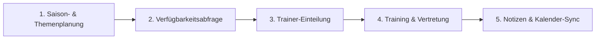

# PocketCoach — Management-Zusammenfassung & Überblick

**Zusammenfassung**: Eine verständliche Übersicht der PocketCoach-Anwendung für Übungsleiter, Cheftrainer und die Vereinsleitung zur Einholung von Feedback.

**Letztes Update**: 2026-07-27

---

← [Zurück zur Anforderungsübersicht](./readme.md) | [English Version](./executive-summary.md)

---

## 🎯 Was ist PocketCoach?

**PocketCoach** ist ein digitaler Trainingsassistent, der speziell für das Trainer-Team unseres Badminton-Vereins entwickelt wird. 

Derzeit läuft die Trainingsorganisation über eine Kombination aus ungeordneten WhatsApp-Gruppen, Excel-Tabellen und manuellen Erinnerungen. PocketCoach ersetzt diese Einzelschritte durch **eine einzige, einfache App** auf dem Smartphone oder Computer.

> ℹ️ **Hinweis für den Vorstand / die Vereinsleitung**: PocketCoach ist ausschließlich für **Trainer, Übungsleiter und Cheftrainer** gedacht. Spieler und Eltern nutzen diese App nicht, wodurch sie fokussiert, sicher und übersichtlich bleibt.

---

## 💡 Hauptvorteile nach Rollen

### 👟 Für Übungsleiter, Hilfstrainer & 14/18-Coaches
* **Alles an einem Ort**: Alle zugewiesenen Trainingseinheiten, Zeiten und Hallen sofort auf einen Blick sehen.
* **Verfügbarkeit mit 1 Klick**: Rückmeldung geben, wann du in den kommenden Monaten trainieren kannst – ohne komplizierte Tabellen.
* **Schnelle Vertretung**: Krank oder verhindert? Einheiten mit 1 Klick als „Vertretung gesucht“ markieren. Wer Zeit hat, kann eine freie Einheit mit einem Klick übernehmen!
* **Kalender-Synchronisierung**: Den eigenen Trainingsplan direkt in den persönlichen Google- oder Apple-Kalender exportieren.
* **Trainingspläne & Notizen**: Schon vor dem Betreten der Halle wissen, welches Wochenthema auf dem Plan steht, und danach kurze Notizen erfassen – selbst wenn es in der Sporthalle kein Internet gibt!
* **Trainings-Statistik**: Übersicht über die Gesamtzahl der geleiteten Trainingseinheiten in der Saison behalten.
* **Einbindung von 14/18-Coaches**: Nachwuchsspieler, die das Training unterstützen, haben ihr eigenes Profil-Label und eine eigene Einteilungsspur.

### 📋 Für Cheftrainer
* **Visuelle Übersicht**: Eine übersichtliche, farbcodierte Matrix aller Trainer-Verfügbarkeiten pro Trainingstag.
* **Faire Arbeitslast**: Auf einen Blick sehen, wie viele Einheiten jeder Trainer absolviert hat, um Überlastung zu vermeiden.
* **Strukturierter Lehrplan**: 6-Wochen-Trainingsblöcke mit Wochenthemen (z. B. *Netzspiel*, *Angriff*) für unsere 3 Trainingsgruppen (*Kids/Basis*, *Advanced-1*, *Advanced-2*) planen.
* **Kein hinterhertelefonieren bei Vertretungen**: Wenn ein Trainer ausfällt, benachrichtigt die App automatisch verfügbare Vertreter.

### 🛡️ Für Vorstand & Administration
* **DSGVO & Datenschutz**: Alle Daten werden ausschließlich auf Servern in Deutschland/Europa gehostet. Es werden nur grundlegende Namen und E-Mail-Adressen gespeichert – keine sensiblen persönlichen Daten.
* **Zweisprachig**: Vollständig auf **Deutsch** und **Englisch** verfügbar.

> 💰 **Kostenhinweis**: 
> - **Web-Anwendung**: **~$0–$1/Monat** (deckt lediglich die eigene Domain ab). Umgeht App-Store-Gebühren vollständig und lässt sich trotzdem als App auf dem Smartphone installieren.
> - **Google Play Store (Android)**: Erfordert eine einmalige Google-Entwicklergebühr von **$25**.
> - **Apple App Store (iOS)**: Erfordert ein Apple-Entwickler-Abo von **$99/Jahr** (auch notwendig, falls Anmeldung mit Apple aktiviert wird).
> 
> *Empfehlung*: Zunächst als Web-Anwendung starten, um mit $0 Entwicklergebühren online zu gehen, und spätere App-Store-Einträge bei Bedarf ergänzen.

---

## ⚙️ Wie PocketCoach funktioniert (Vereinfachter Ablauf)

1. **Saisonplanung**: Cheftrainer legen das Trainingsjahr (Aug–Jul) mit wöchentlichen Schwerpunktthemen fest.
2. **Verfügbarkeitsabfrage (2x pro Jahr)**: Trainer füllen eine kurze Abfrage aus (✅ *Verfügbar*, ❌ *Nicht verfügbar*, 🔶 *Eventuell*).
3. **Trainer-Einteilung**: Cheftrainer teilen 2–3 Haupttrainer plus Hilfstrainer pro Einheit basierend auf den Rückmeldungen ein.
4. **Intelligente Vertretung**: Fällt ein Trainer aus, geht eine Benachrichtigung raus. Jeder freie Trainer kann mit 1 Klick einspringen.
5. **In der Halle**: Trainer sehen den Wochenplan, leiten das Training und tragen kurzes Feedback nach der Einheit ein.

---

## ❌ Was PocketCoach NICHT macht (Außerhalb des Umfangs)

Um die Anwendung einfach und übersichtlich zu halten, sind folgende Funktionen **nicht** enthalten:
* **Keine Spieler-Zugänge**: Spieler melden sich nicht an und sehen keine Trainingspläne.
* **Kein Zahlungsverkehr / Abrechnung**: Vereinsfinanzen bleiben komplett getrennt.
* **Keine Spielergebnisse oder Ranglisten**: Der Fokus liegt zu 100 % auf der Trainingsorganisation.
* **Keine Leistungstest-Erfassung**: Spezielle Fitnesstests sind vorerst ausgeschlossen.

---

## ❓ Fragen für euer Feedback

Wir möchten sicherstellen, dass PocketCoach optimal zu eurer alltäglichen Vereinsarbeit passt! Bitte gebt uns Rückmeldung zu folgenden Punkten:

1. **Verfügbarkeitsabfrage**: Ist eine Verfügbarkeitsabfrage zweimal im Jahr (Aug–Dez und Jan–Jul) für euch praktikabel?
2. **Vertretungs-Benachrichtigungen**: Soll die App Benachrichtigungen für Vertretungsanfragen senden? Oder sollte das vorerst über WhatsApp laufen und erst später in PocketCoach integriert werden?
3. **Kalender-Synchronisierung**: Würdet ihr die Funktion nutzen, um eure Trainingstermine direkt in euren privaten Smartphone-Kalender einzubinden?
4. **Gesamteindruck**: Fehlt euch etwas Wichtiges oder gibt es etwas, das für unseren Verein überflüssig wirkt?
