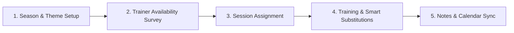

# PocketCoach — Executive Summary & Non-Technical Overview

**Summary**: A friendly, non-technical overview of the PocketCoach application designed for trainers, head coaches, and club management feedback.

**Last updated**: 2026-07-27

---

← [Back to Requirements Index](./readme.md) | [Deutsche Version](./executive-summary-de.md)

---

## 🎯 What is PocketCoach?

**PocketCoach** is a digital assistant created specifically for our badminton club's coaching staff. 

Currently, managing training relies on a mix of scattered WhatsApp messages, Excel sheets, and manual reminders. PocketCoach replaces these manual steps with **one simple app** on your phone or computer.

> ℹ️ **Note for Club Leadership**: PocketCoach is built strictly for **trainers and head coaches**. Players and parents do not use this app, keeping it focused, secure, and uncluttered.

---

## 💡 Key Benefits by Role

### 👟 For Trainers & Assistant Coaches (Übungsleiter, Hilfstrainer & 14/18 Coaches)
* **Everything in One Place**: See all your assigned training sessions, times, and halls instantly.
* **1-Tap Availability**: Mark when you can or cannot train for upcoming months without messy spreadsheets.
* **Instant Substitutions (Vertretung)**: Sick or busy? Flag your session in 1 click. If you are free and want to take over an open session, volunteer with a single tap!
* **Phone Calendar Sync**: Export your training schedule directly to Google Calendar or Apple Calendar.
* **Session Plans & Notes**: Know what training theme is scheduled for the week before you step onto the court, and log quick notes afterwards—even if the sports hall has no internet connection!
* **Coaching Stats**: Keep track of how many total sessions you have coached during the season.
* **Includes 14/18 Junior Coaches**: Junior players assisting regular training have their own profile tag and independent scheduling track.

### 📋 For Head Trainers (Cheftrainer)
* **Visual Overview**: See an easy color-coded grid of who is available on each training date.
* **Balanced Workloads**: Instantly see how many total sessions each trainer has done to avoid overloading anyone.
* **Structured Curriculum**: Plan 6-week training blocks and assign weekly themes (e.g., *Net Play*, *Attacking*) across our 3 player groups (*Kids/Basic*, *Advanced-1*, *Advanced-2*).
* **No More Chasing Substitutes**: When a trainer is absent, the app alerts available trainers automatically.

### 🛡️ For Club Management & Admins
* **GDPR & Privacy First**: All data is hosted strictly within Europe (Germany). We only store basic names and emails—no sensitive personal details.
* **Bilingual**: Fully available in **German** and **English**.

> 💰 **Cost Note**: 
> - **Web Application**: **~$0–$1/month** (covers basic domain name). Bypasses app store fees completely while remaining installable on phones.
> - **Google Play Store (Android)**: Requires a **$25 one-time** Google Developer account fee.
> - **Apple App Store (iOS)**: Requires a **$99/year** Apple Developer subscription (also required if Apple Sign-In is enabled).
> 
> *Recommendation*: Start with the Web Application to launch with $0 developer fees, and upgrade to native App Store listings later if needed.

---

## ⚙️ How PocketCoach Works (Simplified Workflow)

1. **Season Planning**: Head trainers set up the training year (Aug–Jul) with weekly training focus areas.
2. **Availability Check (2x a year)**: Trainers fill out a quick survey indicating dates they are ✅ Available, ❌ Unavailable, or 🔶 Tentative.
3. **Session Assignment**: Head trainers assign 2–3 regular trainers plus assistant coaches per session based on availability.
4. **Smart Substitutions**: If a trainer cannot make it, an alert goes out. Any available trainer can step in with 1 click.
5. **On Court**: Trainers view the weekly plan, run the session, and add quick post-session feedback notes.

---

## ❌ What PocketCoach DOES NOT Do (Out of Scope)

To keep the application simple and easy to use, the following are **not** included:
* **No Player Accounts**: Players do not log in or see training schedules.
* **No Payments or Billing**: Club finances remain completely separate.
* **No Match Results or Rankings**: Focus is 100% on training & session organization.
* **No Fitness Test Tracking**: Specialized fitness testing is excluded for now.

---

## ❓ Questions for Your Feedback

We want to make sure PocketCoach fits your day-to-day workflow! Please share your thoughts on the following points:

1. **Availability Surveys**: Is answering an availability survey twice a year (Aug–Dec and Jan–Jul) convenient for you?
2. **Substitution Notifications**: Should the application send notifications for substitution requests? Or is it something that should be handled through WhatsApp for now and added to PocketCoach later?
3. **Calendar Sync**: Would you use the feature to sync your training sessions into your personal mobile calendar?
4. **General Impression**: Is there anything missing or anything that feels unnecessary for our club?
